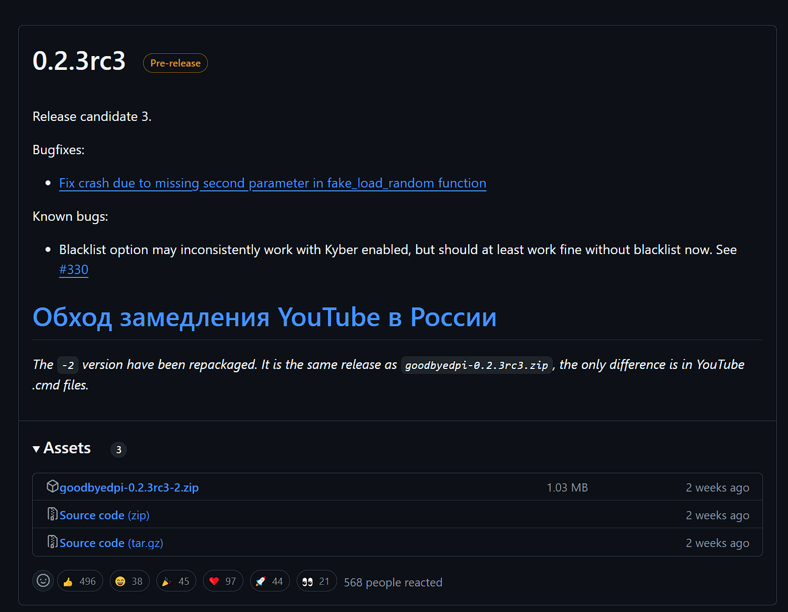
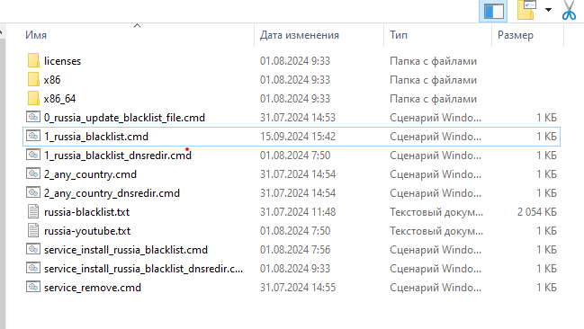
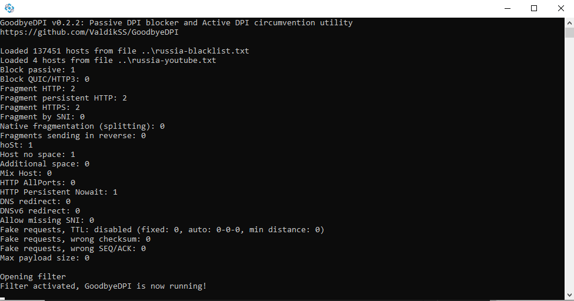
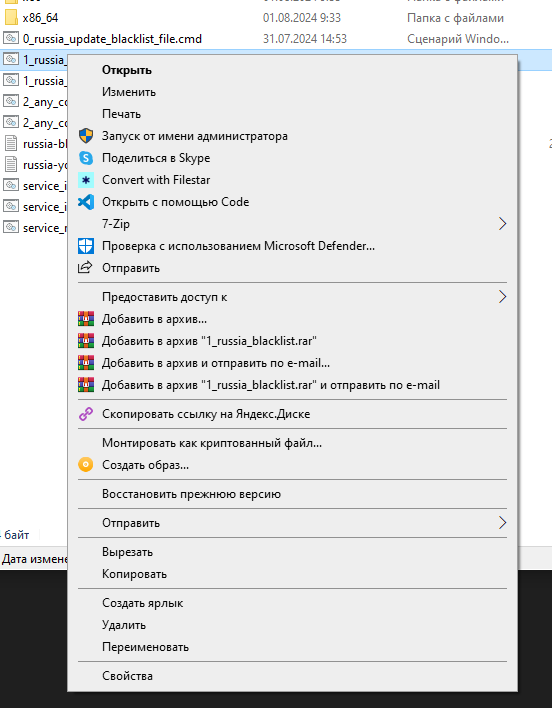
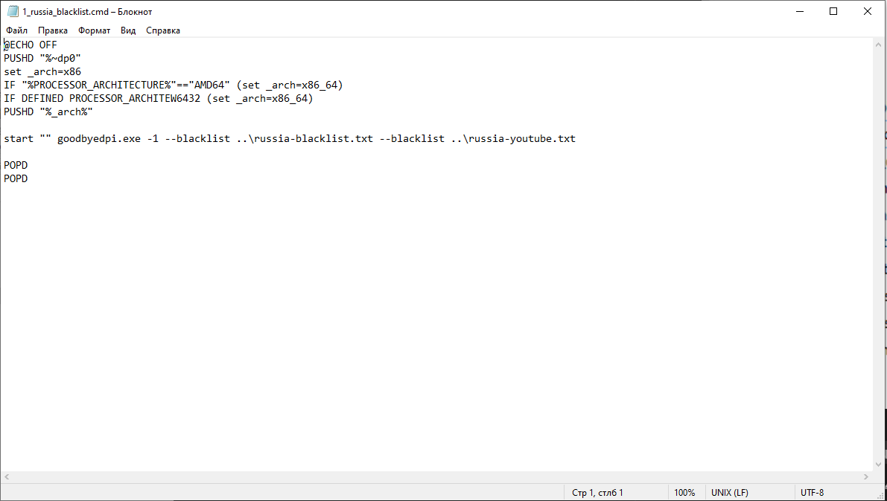
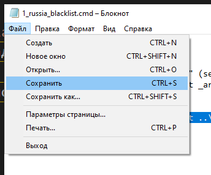

# Инструкция по скачиванию и настройке GoodbyeDPI

> [!CAUTION]
> Youtube будет доступен пока работает программа GoodbyeDPI, поэтому не закрывайте ее, можно просто свернуть.

Первым делом, нужно скачать GoodbyeDPI. Заходим [список релизов GoodbyeDPI](https://github.com/ValdikSS/GoodbyeDPI/releases), находим там последний релиз (например, 0.2.3rc3 как на картинке).

Внизу есть блок Assets, кликаем по нему, открывается список файлов (артефактов), и кликаем на имя файла (архива) с .zip в конце названия (например, goodbyedpi-0.2.3rc3-2.zip
). Это архив с программой.

Когда архив скачался, распаковываем его на компьютере и заходим в папку, в которую распаковали архив. Список файлов будет выглядет примерно как на картинке.

Нам нужен файл `1_russia_blacklist` (или `1_russia_blacklist.cmd`, если у Вас включено отображение расширения файла). Программа попросит дать ей права администратора, смело нажимаем `Да`.

Готово, запущенная программа должна выглядеть примерно как на картинке ниже.

## Если GoodbyeDPI запущен, но youtube так и не работает

В этом случае, можно попробовать изменить флаг, с которым запущена программа. Для этого кликаем правой кнопкой мыши по файлу `1_russia_blacklist` и в появившемся меню нажимаем Изменить. 

 

Откроется блокнот с кодом.

После текста `start "" goodbyedpi.exe ` стоит знак минус (`-`) и цифра. Например, `start "" goodbyedpi.exe -8`. Нужно заменить эту цифру на `1` или `9`, то есть чтобы получилось что-то типа:

- `start "" goodbyedpi.exe -1 --blacklist ..\russia-blacklist.txt --blacklist ..\russia-youtube.txt`

или

- `start "" goodbyedpi.exe -9 --blacklist ..\russia-blacklist.txt --blacklist ..\russia-youtube.txt`

Теперь сохраняем файл (на верхней панели Блокнота кликаем на Файл и далее Сохранить). Теперь можно снова запустить программу (файл `1_russia_blacklist`).

Если и это не помогло, то можно воспользоваться [этой инструкцией на Pikabu](https://pikabu.ru/story/chto_delat_esli_goodbyedpi_perestal_rabotat_230924_11834686?utm_source=linkshare&utm_medium=sharing&utm_campaign=mobile_native_share).
